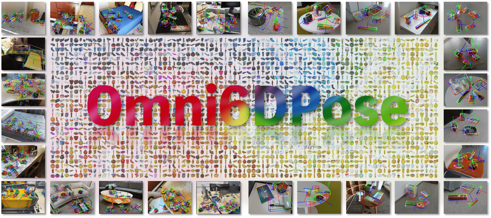

# <span style="color: #9AEA27;">Omni6DPose</span>: A Benchmark and Model for Universal 6D Object Pose Estimation and Tracking

[](https://jiyao06.github.io/Omni6DPose/)
[](https://arxiv.org/pdf/2406.04316.pdf)
[](https://jiyao06.github.io/Omni6DPose/download/)
[](https://github.com/Omni6DPose/Omni6DPoseAPI/)
[](https://jiyao06.github.io/Omni6DPose/cutoop/)
[](https://github.com/Omni6DPose/Omni6DPoseAPI/blob/main/LICENSE)
[](https://hits.seeyoufarm.com)


The official repository of Omni6DPose API, as presented in
[Omni6DPose](https://arxiv.org/pdf/2406.04316). (ECCV 2024)

## 📗 Overview


We introduce **<span style="color: #9AEA27;">Omni6DPose</span>**, a substantial dataset featured by its **diversity in object categories**, **large scale**, and **variety in object materials**. 


## ✨ News
* **2024.08.01**: The **<span style="color: #9AEA27;">Omni6DPose</span>** dataset and API are released! 🎉
* **2024.07.01**: **<span style="color: #9AEA27;">Omni6DPose</span>** has been accepted by ECCV2024! 🎉


## 📆 TODO
- [x] Release the Omni6DPose dataset. 
- [x] Release the Omni6DPose API.
- [ ] Release the GenPose++ and pretrained models.
- [ ] Release a convenient version of GenPose++ with SAM for the downstream tasks.


## 🗂️ Download the Omni6DPose Dataset
The Omni6DPose dataset is available for download at [Omni6DPose](https://www.dropbox.com/scl/fo/ixmai3d7uf4mzp3le8sz3/ALRxBZUhhaAs11xH56rJXnM?rlkey=sn7kyuart2i8ujeu1vygz4wcy&st=8yy78r6z&dl=0). The dataset is organized into four parts:
- **Meta:** the meta information of the dataset.
- **ROPE:** the real dataset for evaluation.
- **SOPE:** the simulated dataset for training.
- **PAM:** the pose aligned 3D models used in both ROPE and SOPE.

Due to the large size of the dataset and the varying requirements of different tasks and methods, we have divided the dataset into multiple parts, each compressed separately. This allows users to download only the necessary parts of the dataset according to their needs. Please follow the instructions within the [download.ipynb](download.ipynb) to download and decompress the necessary dataset parts.

**Note:** The meta file `Meta/obj_meta.json` is corresponding to the `SOPE` dataset, and the meta file `Meta/real_obj_meta.json` is corresponding to the `ROPE` dataset. When you using the dataset and the fllowing API, please make sure to use the correct meta file.


## 🔨 Omni6DPose API
We provide Omni6DPose API `cutoop` for visualization and evaluation, which provides a convenient way to load the dataset and evaluate and visualize the results. The API is designed to be user-friendly and easy to use. Please refer to the [Omni6DPose API](https://jiyao06.github.io/Omni6DPose/cutoop/) for more details.

### Installation
To enable EXR image reading by OpenCV, you need to install OpenEXR. On ubuntu, you can install it using the following command:
```bash
sudo apt-get install openexr
```

Then, the API can be installed using the following two ways:
- **Install from PyPI:**
```bash
pip install cutoop
```
- **Install from source:**
```bash
cd common
python setup.py install
```

### Usage
Please refer to the [documentation](https://jiyao06.github.io/Omni6DPose/cutoop/) for more details.


## 🎯 Baseline
GenPose++ comming soon!

## 📮 Contact
If you have any questions, please feel free to contact us:

[Jiyao Zhang](https://jiyao06.github.io/): [jiyaozhang@stu.pku.edu.cn](mailto:jiyaozhang@stu.pku.edu.cn)

[Weiyao Huang](https://github.com/sshwy): [sshwy@stu.pku.edu.cn](mailto:sshwy@stu.pku.edu.cn)

[Bo Peng](https://github.com/p-b-p-b): [bo.peng@stu.pku.edu.cn](mailto:bo.peng@stu.pku.edu.cn)

[Hao Dong](https://zsdonghao.github.io/): [hao.dong@pku.edu.cn](mailto:hao.dong@pku.edu.cn)

## 📝 License
This project is released under the MIT license. See [LICENSE](LICENSE) for additional details.
